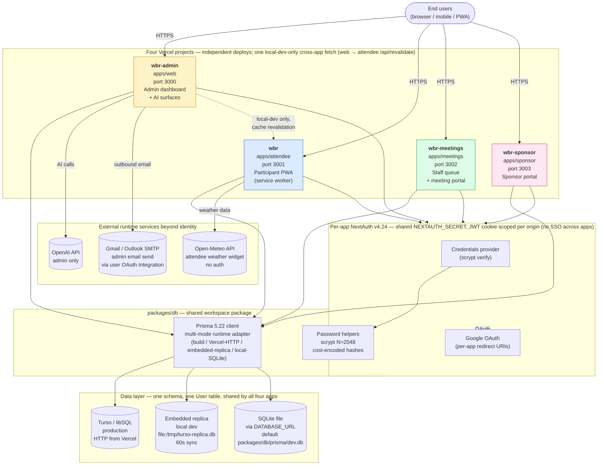

# WBR Architecture

Current-state architecture of the WBR conferencing app. Written for cold pickup by an engineer or AI agent — i.e. enough detail to understand how the system fits together without reading every file, and enough file references to drill down when needed.

## Contents

- [At a glance](#at-a-glance)
- [System diagram](#system-diagram)
- [The four apps](#the-four-apps)
- [Data flow](#data-flow)
- [Identity and auth](#identity-and-auth)
- [API surface](#api-surface)
- [PWA layer (attendee only)](#pwa-layer-attendee-only)
- [Deployment topology](#deployment-topology)
- [Shared packages](#shared-packages)
- [Known limitations and operational gaps](#known-limitations-and-operational-gaps)
- [Reference map](#reference-map)

## At a glance

WBR is a **monorepo of four Next.js 15 apps** sharing one database, one identity model, and one set of utility packages. Each app deploys independently to its own Vercel project.

| Component | What it is |
|---|---|
| Monorepo orchestrator | Turborepo 2.9 + pnpm 10.8 workspaces |
| Framework | Next.js 15.5.15 (App Router) on React 19.2 |
| Styling | Tailwind CSS 3.4 — no component library |
| Identity | NextAuth v4.24 with JWT sessions |
| Data layer | Prisma 5.22 + libSQL (Turso) — SQLite locally, Turso in production |
| Hosting | Four independent Vercel projects |
| AI | OpenAI SDK in `apps/web` only |
| TypeScript | 5.9 strict mode — but build silently ignores TS + ESLint errors |

## System diagram



Key invariants shown by the diagram:

- **App-to-app API calls are almost absent.** "Data flow between the four apps" overwhelmingly happens at the shared-database layer, not at the application layer. One narrow exception: `apps/web/app/(dashboard)/dashboard/speakers/[id]/page.tsx` and `apps/web/app/api/speakers/[id]/route.ts` fetch `http://localhost:3001/api/revalidate` (the attendee app's `revalidateTag` endpoint) on speaker updates. The URL is hardcoded to localhost, so the call **only succeeds in local dev** where both servers run on the same machine; in production it silently fails into a catch block. All other cross-app coordination relies on the shared schema — a change in one app's data is visible to the other three on the next read.
- **Per-app auth, shared secret.** Each app mounts its own NextAuth instance and issues its own JWT session cookie scoped to its own origin. All four apps share `NEXTAUTH_SECRET` and the `User` table, so the same credentials work everywhere — but **there is no single-sign-on**; users log in to each app independently. See [Identity and auth](#identity-and-auth).
- **One Prisma schema, one User table, three runtime data backends.** The multi-mode client at `packages/db/src/client.ts` picks the right backend per environment: HTTP libSQL on Vercel, embedded replica during long-running local dev, plain SQLite as the local fallback. See [Data flow → Database client](#database-client-packagesdbsrcclientts).
- **Independent deploys.** Each app is its own Vercel project. A failure in one app's build does not block the others; per-app env-var matrices, custom-domain mappings, and build caches are isolated. See [Deployment topology](#deployment-topology). Vercel project names locally confirmed: `apps/web` → `wbr-admin` (`.vercel/repo.json`), `apps/attendee` → `wbr` (`apps/attendee/.vercel/project.json`); names for `apps/meetings` and `apps/sponsor` are operationally defined (best confirmed via the Vercel UI on the `june-1220s-projects` team).
- **External surfaces beyond identity, all narrow.** Beyond Google OAuth (the only shared external identity provider), runtime apps reach four other external services: **OpenAI API** (admin only — sponsor-reminder personalization and admin AI surfaces); **Open-Meteo weather API** (attendee home screen widget, no auth); **Gmail / Outlook SMTP** (admin email send, via per-user OAuth Integration rather than a global service account); and **Google admin Integration callback** (`apps/web/app/api/integrations/google/callback` — a separate OAuth flow from sign-in, used to wire admin Gmail accounts for the email-send path).

## The four apps

### `apps/web` — admin dashboard (port 3000)

Back-office tool for WBR organizers. Login is gated to `STAFF`, `ORGANIZER`, or `ADMIN` role values via the credentials provider in `apps/web/lib/auth.ts`. Surfaces:

- Conference dashboard (health metrics, sponsor readiness scorecard)
- Speaker, session, sponsor, time-block, meeting, and attendee management
- Email composer + audit log
- Conference settings + third-party integration management
- AI-assisted surfaces (OpenAI SDK; sponsor-reminder personalization is the primary current integration point)

This app is the most-developed of the four. Recent commit traffic concentrates here on dashboard performance — the server-side prefetch into React Query `initialData` pattern under `apps/web/app/(dashboard)/`.

### `apps/attendee` — participant PWA (port 3001)

Progressive Web App for conference attendees. Mobile-first. Uses `@ducanh2912/next-pwa` for service-worker generation. Offline behavior comes entirely from the service worker's network-first page/data caching (see [PWA layer](#pwa-layer-attendee-only)); React Query runs with a plain in-memory client (`apps/attendee/lib/query-provider.tsx`) — no React Query persistence layer in attendee. The persist plugin (`@tanstack/react-query-persist-client` + `idb-keyval`) is present in `meetings` and `sponsor` only.

No role restriction. Google OAuth sign-ins auto-create a `User` row with role `ATTENDEE`. Surfaces: home, schedule, my schedule (bookmarks), speakers, people directory, chat (DB-polled DMs — no websocket layer), setup (blackout times + sponsor interests).

### `apps/meetings` — meeting coordination portal (port 3002)

Desktop-oriented portal for the 1-on-1 *business* meeting workflow. Same user base as attendee — no role restriction at login. The `/staff` route is the operational core: it loads the latest 100 `MeetingRequest` rows (ordered by `createdAt desc`, across all statuses) plus all `TimeBlock` rows for `conferenceId = 'conf-2025'` (scoped to the seeded conference id), and renders the `StaffQueue` client component. The UI defaults to a `PENDING` filter; `STAFF` users approve, reject, or — on approve/confirm — assign the request to a `TimeBlock`. The `MeetingRequest.status` and `timeBlockId` are updated; **on confirm with a time block, the route handler additionally creates a `SponsorMeeting` row** when both a `sponsorId` and an `attendeeId` can be derived from the request (it does *not* create a `Meeting` row). Backing API: `apps/meetings/app/api/meeting-requests/[id]/route.ts`.

**Attendees do not pick their own meeting times.** They request → recipient approves → staff assigns. This is deliberate manual curation, not a missing self-service feature.

### `apps/sponsor` — sponsor company portal (port 3003)

Used by employees of sponsoring companies. Access is gated by `User.sponsorId` (a foreign key into the `Sponsor` table), not by role. The presence of a non-null `sponsorId` is what tells the portal which company the current user represents.

Surfaces: dashboard, attendee browse + meeting request, inbound/outbound request management, scheduled meetings, company profile editor, custom submission forms (six types: `ABSTRACT` / `FULL_PAPER` / `SPEAKER_PROPOSAL` / `PANEL` / `SYMPOSIUM` / `CUSTOM`), team management.

## Data flow

### Schema (`packages/db/prisma/schema.prisma`)

The full domain model lives in a single Prisma schema. SQLite is the engine — as a local file in dev, transported over libSQL/HTTP via Turso in production. All four apps consume the same generated Prisma client via the `@conference/db` package.

Entities, grouped:

- **Identity** — `User` (one human; carries role + bio + B2B-matchmaking fields + optional `sponsorId`), plus NextAuth adapter tables `Account`, `Session`, `VerificationToken`.
- **Conference** — `Conference` (one event with an `active` flag), `Speaker`, `ConfSession` (named to avoid colliding with NextAuth's `Session`), `SessionBookmark`.
- **Meetings** — `TimeBlock` (empty slot with capacity), `MeetingRequest` (the ask; status moves `PENDING` → `APPROVED`/`REJECTED` → `CONFIRMED`), `Meeting` (peer-to-peer, scheduled into a `TimeBlock`), `SponsorMeeting` (sponsor-booth, separate model), `BlackoutTime` (unavailability), `ConflictLog` (auto-detected speaker double-bookings).
- **Sponsors** — `Sponsor` (company with tier, target industries/sizes/revenues for matchmaking, contact info, booth number).
- **Messaging** — `ChatRoom` (`CHANNEL` or `DIRECT`), `ChatMember`, `Message` (DB-persisted, polled — no real-time transport).
- **Sponsor forms** — `SubmissionForm`, `FormSubmission`.
- **Social (built but largely unused)** — `Follow`, `Post`, `PostLike`.
- **Operational** — `EmailLog`, `Integration`.

### User roles

`User.role` is a **free-form string column**, not an enum. Values used in practice: `ATTENDEE`, `SPEAKER`, `ORGANIZER`, `STAFF`, `ADMIN`. The schema comment only lists the first three; `STAFF` and `ADMIN` exist by convention in the seed and the auth code.

A "sponsor user" is not a role. It is `User.sponsorId` populated with a `Sponsor.id`. The user's role typically remains `ATTENDEE`. The sponsor portal gates by the presence of `sponsorId`, not by role.

Only `apps/web` enforces role at login (`STAFF` / `ORGANIZER` / `ADMIN` — see `apps/web/lib/auth.ts:43`). The other three apps allow any account in and gate features post-login.

### Database client (`packages/db/src/client.ts`)

A multi-mode client. The mode is chosen at runtime per environment:

| Env condition | Mode | Reason |
|---|---|---|
| `NEXT_PHASE === phase-production-build` | Local SQLite (no Turso) | Build phase has no live DB |
| `VERCEL` set + Turso creds | Turso HTTP (`@libsql/client/web`) | Serverless can't hold persistent connections |
| Otherwise + Turso creds | Embedded replica (local file, 60s sync interval) | Local-speed reads with eventual consistency |
| No Turso creds | Local SQLite via `DATABASE_URL` | Dev default |

Embedded-replica mode wraps queries in a `$extends` guard that:
1. Awaits the initial `libsql.sync()` before any read so the very first query is never stale.
2. After write operations, kicks off a background `libsql.sync()` so subsequent reads see fresh data.

`dbConnectionMode` (an exported mutable string) is the diagnostic hook for confirming which mode is active in a given environment.

### Local vs Turso credentials

- Local: `DATABASE_URL="file:./packages/db/prisma/dev.db"`
- Vercel runtime: `TURSO_DATABASE_URL="libsql://..."` + `TURSO_AUTH_TOKEN="..."`

`turbo.json` declares these as the env vars to plumb through the build and dev pipelines. The repo-root `.env.example` documents the local subset; per-app `.env.local.example` files (in `apps/attendee/` and `apps/web/`) document per-port `NEXTAUTH_URL` overrides.

### Server-side pagination — admin attendees (`apps/web`)

The admin `/dashboard/attendees` route is the one endpoint in the codebase that ships paginated rows rather than the full collection. The same Prisma query function (`apps/web/lib/attendees-query.ts → fetchAttendeesPage`) is consumed by both surfaces:

- **SSR** (`apps/web/app/(dashboard)/dashboard/attendees/page.tsx`) calls `fetchAttendeesPage({ page: 0 })` and passes the result to `AttendeesTable` as `initialData`.
- **Client refetch + interaction** (`apps/web/components/AttendeesTable.tsx → useAttendeesPage`) calls `GET /api/data/attendees?page=N&q=...&role=...` whenever the page, debounced search (250 ms), or role filter changes. React Query keys on the param object so each unique view caches independently; `placeholderData: prev` keeps the previous page visible while the next request lands.

The route handler (`apps/web/app/api/data/attendees/route.ts`) reads the same params off `URL.searchParams` and delegates to `fetchAttendeesPage`, returning `{ rows, total, page, pageSize, hasMore }`. There is no `unstable_cache` on this endpoint — the 50-row paginated Prisma query is cheap enough that the cache wasn't load-bearing, and removing it sidesteps a per-page invalidation matrix on Add/Edit.

Other `/api/data/*` endpoints (sessions, speakers, sponsors, meetings, dashboard, calendar, chat, email, access) still return their full collection per call. Extending the pagination pattern to another endpoint means adding a sibling `lib/<resource>-query.ts` function and re-shaping both the SSR caller and the React Query hook to take params.

## Identity and auth

### NextAuth v4.24

All four apps run NextAuth v4.24.x mounted at `app/api/auth/[...nextauth]/route.ts`. Each app exports its own `authOptions` from `lib/auth.ts`. Two providers are configured everywhere:

- **`CredentialsProvider`** — email/password against the `User` table. Password verification uses scrypt with `timingSafeEqual` (see `packages/db/src/index.ts` — `verifyPassword`). The stored hash format encodes the scrypt cost factor: `<hex-hash>.<salt>.<N>`. Legacy hashes without a cost field fall back to Node's default `N = 16384`.
- **`GoogleProvider`** — OAuth via Google. In attendee / meetings / sponsor: a successful Google sign-in auto-creates a `User` with role `ATTENDEE` if no row exists for the email. In admin: the `signIn` callback rejects the sign-in unless the email already maps to a `STAFF` / `ORGANIZER` / `ADMIN` row.

Sessions are JWT (`session: { strategy: 'jwt' }`). The cookie is `next-auth.session-token` — HTTP-only, secure in production, 30-day expiry.

### Middleware (`apps/<app>/middleware.ts`)

Each app's middleware decodes the JWT once per request, then exposes user identity to downstream code. **Two patterns are in use** and the choice matters for route-handler authoring:

- **Request-header forwarding — `meetings` and `sponsor`.** The middleware builds a new `Headers` object with `x-user-id`, `x-user-role`, `x-user-sponsor-id` (sponsor additionally sets `x-user-sponsor-name`, `x-user-sponsor-logo-url`, `x-user-name`) and returns `NextResponse.next({ request: { headers: requestHeaders } })`. Downstream server components and route handlers read the values via `headers()` from `next/headers` (e.g. `apps/meetings/lib/user.ts:getUserFromHeaders`). One JWT decode per request.
- **Response-header only — `attendee` and `web`.** The middleware sets `x-user-id` / `x-user-role` (attendee additionally sets `x-user-sponsor-id`) on the `NextResponse` object. These headers ride back to the browser; they are **not** visible to downstream route handlers. Route handlers in these apps re-derive identity via `getServerSession` / `getToken` from `next-auth` — a second decode per request.

Unauthenticated requests to non-auth routes get redirected to `/login` (or returned as `{ error: 'Unauthorized' }` JSON with status 401 for `/api/*`). Authenticated requests to `/login` redirect to the app's landing route (`/home`, `/dashboard`, `/`, etc.).

The matcher pattern also varies per app. `apps/web/middleware.ts` uses a regex that excludes static-asset paths *and* common image extensions; `attendee`, `meetings`, and `sponsor` exclude a fixed path set (`_next/static`, `_next/image`, `favicon.ico`, `icons`, `manifest.json`, `sw.js`, `workbox-*`). See each `middleware.ts` for the exact `config.matcher`.

### Cross-app identity

All four apps share the same `User` table and `NEXTAUTH_SECRET`, so the same credentials log in everywhere. But each app issues its own JWT, so a user has to log into each app independently. There is no single sign-on across the four.

## API surface

Each app owns its `app/api/*` route tree. There is no shared API gateway. One narrow cross-app exception: the admin app fetches `http://localhost:3001/api/revalidate` (the attendee app's `revalidateTag` endpoint) from `apps/web/app/(dashboard)/dashboard/speakers/[id]/page.tsx` and `apps/web/app/api/speakers/[id]/route.ts` on speaker updates. The URL is hardcoded to localhost; the fetch succeeds in local dev but silently no-ops in production (the catch block swallows the error). Production cross-app cache invalidation effectively does not work today.

| App | API responsibilities |
|---|---|
| `web` | Full admin surface — auth, conference + speaker + session + sponsor + time-block + meeting + attendee CRUD, email send + log, integration OAuth flows, AI surfaces (OpenAI), exports |
| `attendee` | Auth, home/schedule/speakers/people read endpoints, chat send/receive (DB-polled), bookmarks, profile editing, blackout times |
| `meetings` | Auth, meeting-request CRUD (`/api/meeting-requests`, `/api/meeting-requests/[id]` — also the staff-queue actions), browse helpers (`/api/browse/{people,sponsors,requests}`), dashboard recommendations, bootstrap, meetings reads, profile |
| `sponsor` | Auth, sponsor profile CRUD (incl. base64 logo upload), attendee browse + meeting-request flows, submission-form CRUD, team management |

**Auth posture in route handlers varies by app** and tracks the middleware pattern split (see [Middleware](#middleware-appsappmiddlewarets)). `meetings` and `sponsor` route handlers primarily read forwarded request headers via `headers()` (with mixed `getServerSession` use in sponsor). `web` route handlers primarily call `getServerSession` / `getToken`. `attendee` route handlers mix `getServerSession` with header reads. There is no single uniform pattern; check the specific app's `lib/` helpers (`user.ts`, `auth.ts`, `session.ts`) before assuming.

## PWA layer (attendee only)

`apps/attendee/next.config.js` wraps the Next.js config in `@ducanh2912/next-pwa`'s `withPWA`. The service worker is generated at production-build time. It is disabled in `NODE_ENV === development`.

Runtime caching rules (current state):

| Rule class | URL pattern | Handler | `networkTimeoutSeconds` |
|---|---|---|---|
| App pages | same-origin, non-`/api/*` | `NetworkFirst` | 10 |
| Next/Image | `/_next/image?url=…` | `NetworkFirst` | 10 |
| RSC / data payloads | `/_next/data/*.json` | `NetworkFirst` | 10 |
| Cross-origin images | non-same-origin `*.jpg|jpeg|png|webp|svg` | `NetworkFirst` | 10 |
| Unsplash images | `images.unsplash.com/*` | `NetworkFirst` | 10 |
| Google Fonts | `fonts.gstatic|googleapis.com/*` | `CacheFirst` | — |
| Static assets | `*.js|*.css` | `StaleWhileRevalidate` | — |

Offline content in attendee comes from these service-worker rules alone — there is no React Query persistence layer in attendee (`apps/attendee/lib/query-provider.tsx` is a plain in-memory `QueryClientProvider`). The persist plugin (`@tanstack/react-query-persist-client` + `idb-keyval`) is installed in `meetings` and `sponsor`, not attendee.

Note that the `_next/data/*.json` rule's URL pattern is Pages-Router-shaped; under App Router the broader page rule is what fires for RSC traffic in practice.

## Deployment topology

Each app deploys as its own Vercel project (four projects total). Per-project build config — see `apps/<app>/vercel.json`:

```json
{
  "buildCommand": "cd ../.. && npx turbo build --filter=<app>",
  "installCommand": "cd ../.. && corepack enable && pnpm install",
  "framework": "nextjs",
  "outputDirectory": ".next"
}
```

### Required env vars per Vercel project

From `turbo.json` (the canonical list of build/dev env keys):

- `DATABASE_URL` — usually unset on Vercel; Turso vars take over at runtime.
- `TURSO_DATABASE_URL`, `TURSO_AUTH_TOKEN` — production data layer credentials.
- `NEXTAUTH_SECRET` — must match across all four projects so JWTs and shared `User`-table reads stay consistent.
- `NEXTAUTH_URL` — per-project; matches each app's deployed URL (or the vanity URL for attendee).
- `GOOGLE_CLIENT_ID`, `GOOGLE_CLIENT_SECRET` — required for Google sign-in.

The admin app additionally reads `ADMIN_EMAILS` (comma-separated allow-list) and `OPENAI_API_KEY`. Other env vars used by specific surfaces (`CONFERENCE_ID`, `SPONSOR_PORTAL_URL`) are listed in the repo-root `.env.example`.

### Build behavior

Every `next.config.js` sets `typescript: { ignoreBuildErrors: true }` and `eslint: { ignoreDuringBuilds: true }`. A failing type-check or lint run does **not** fail a Vercel build. To catch issues, run `pnpm typecheck` and `pnpm lint` manually — those are honest.

`@prisma/adapter-libsql`, `@libsql/client`, and `libsql` are declared as `serverExternalPackages` so Next.js does not try to bundle their native bindings.

## Shared packages

### `@conference/db` (`packages/db/`)

The active data layer. Exports:
- The singleton `prisma` client (multi-mode per [Data flow → Database client](#database-client-packagesdbsrcclientts))
- All generated Prisma types (re-exported from `@prisma/client`)
- The `dbConnectionMode` diagnostic string
- Password helpers (`hashPassword`, `verifyPassword` — scrypt-based with cost-factor encoding)
- A handful of composite types (`SessionWithSpeaker`, `MeetingWithDetails`) and domain helpers (date grouping with timezone support, speaker conflict detection, blackout-time conflict checks)

### `@conference/types` (`packages/types/`)

Hand-written TypeScript types. **Out of sync.** Uses snake_case field names from the abandoned Supabase data model. Do not import; read the Prisma schema instead.

### `@conference/supabase` (`packages/supabase/`)

Dead code. No app imports it. A pre-Prisma artifact. Candidate for removal in a future cleanup phase.

## Known limitations and operational gaps

Surfaced so cold readers do not have to discover these by tripping on them.

- **No CI/CD pipeline.** No `.github/workflows/` directory. Vercel auto-deploys from the main branch.
- **No automated tests** at any layer (unit, integration, E2E).
- **No error tracking.** No Sentry / Datadog / equivalent.
- **No migration history.** Schema changes go through `prisma db push`, which does not record diffs. `supabase/migrations/001_initial.sql` is stale and is not run against the current database.
- **No real file storage.** Logos, hero images, and speaker photos are external URLs or base64-encoded strings in the database.
- **No transactional email beyond manual admin sends.** Mail goes via a user-configured Gmail/Outlook OAuth `Integration`; without one, emails are logged to `EmailLog` but not delivered.
- **No in-app notifications, push notifications, or audit trail.**
- **No production-safe rate limiting.** The sponsor app's in-memory limiter is bypassed by Vercel's multi-instance runtime.
- **Type and lint errors silently ignored at build time** — see [Deployment → Build behavior](#build-behavior).

## Reference map

| When you need… | Look at |
|---|---|
| A specific code path | The relevant app's `app/`, `components/`, and `lib/` directories |
| The data model | `packages/db/prisma/schema.prisma` |
| A seeding example or demo credentials | `packages/db/prisma/seed.ts` |
| The PWA cache rules | `apps/attendee/next.config.js` |
| Auth config for an app | `apps/<app>/lib/auth.ts` and `apps/<app>/middleware.ts` |
| Vercel build config for an app | `apps/<app>/vercel.json` |
| The env-var contract | `.env.example` (root), `apps/<app>/.env.local.example`, `turbo.json` |
| Why the architecture is what it is | `docs/decisions.md` (added in Phase 0b) |
| Operational procedures | `docs/runbook.md` (added in Phase 0b) |
| Symptom-to-cause for known failures | `docs/incident-playbook.md` (added in Phase 0b) |
